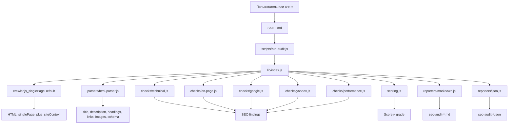

# IndexLift SEO Auditor

Portable SEO audit skill for agents. Designed for `Cursor`, `Agent Skills`-compatible clients, and OpenClaw-style workflows.

Russian guide: [README.ru.md](README.ru.md)

This repository contains **one thing**: a reusable skill package that runs ultra-detailed single-page SEO audits by default, with separate Google and Yandex checks and JSON + Markdown deliverables.

## Описание На Русском

Этот репозиторий содержит только один продукт: self-contained SEO skill для Cursor и других agent skill-совместимых клиентов.

Репозиторий нужен для запуска сверхподробного аудита одной страницы с отдельными проверками под `Google` и `Yandex`. `robots.txt` и sitemap используются как site context, а не как подмена полноценного обхода сайта. При необходимости можно вручную включить `crawl`-режим.

- Markdown-отчет для человека
- JSON-артефакт для агента или последующей обработки
- scoring по техническим, on-page, engine-specific и performance сигналам

Важно: это не агентская платформа, не dashboard и не полный SaaS-продукт. Здесь лежит только skill со встроенными скриптами и runtime.

## Схема Работы



## Как Работает Репозиторий

1. Агент читает `.agents/skills/indexlift-seo-auditor/SKILL.md` и понимает, когда использовать skill.
2. Запускается `scripts/run-audit.js` с параметрами `--url`, `--mode`, `--tier`, `--engines`, `--output`.
3. По умолчанию `scripts/lib/crawler.js` fetch-ит только стартовую страницу, а `robots.txt` и sitemap использует как supporting context.
4. `scripts/lib/parsers/html-parser.js` извлекает SEO-данные из HTML и собирает точный page snapshot.
5. Модули в `scripts/lib/checks/` формируют page-level проблемы и отдельно помечают context-only сигналы.
6. `scripts/lib/scoring.js` считает итоговый score только по честным page-level findings.
7. `scripts/lib/reporters/` сохраняет двухслойный отчет: client summary сверху и deep technical diagnostics ниже.

## Быстрый Старт По-Русски

```bash
cd .agents/skills/indexlift-seo-auditor
npm install
node scripts/run-audit.js --url "https://example.com" --tier standard --engines google,yandex --output ./deliverables/
```

Default mode is `single-page`. If you want the legacy wider crawl, run:

```bash
node scripts/run-audit.js --url "https://example.com" --mode crawl --tier standard --engines google,yandex --output ./deliverables/
```

## Что Где Лежит

```text
.agents/
  skills/
    indexlift-seo-auditor/
      package.json
      SKILL.md
      scripts/
        run-audit.js
        lib/
          crawler.js
          index.js
          scoring.js
          checks/
          parsers/
          reporters/
      references/
        install.md
        checks.md
README.md
README.ru.md
LICENSE
```

## What It Is

`IndexLift SEO Auditor` is a skill-first package, not an agent platform.

It includes:

- a standard `Agent Skills` skill directory
- a bundled audit script
- a self-contained crawl and scoring runtime inside the skill folder
- installation docs for Cursor and compatible clients

It does **not** pretend to include:

- paid backlink APIs
- competitor intelligence from external providers
- live SERP scraping from external providers
- a dashboard or business automation platform

This repository intentionally stays inside free local tooling only.

## Quick Start

```bash
cd .agents/skills/indexlift-seo-auditor
npm install
node scripts/run-audit.js --url "https://example.com" --tier standard --output ./deliverables/
```

## Cursor Install

Cursor supports both `.agents/skills/` and `.cursor/skills/`, so this repo already uses a compatible layout.

### Option 1: Open the repo directly

1. Clone the repository.
2. Open it in Cursor.
3. Cursor will discover the skill from `.agents/skills/indexlift-seo-auditor/`.

### Option 2: Install globally for Cursor

Copy the skill folder to:

```text
~/.cursor/skills/indexlift-seo-auditor/
```

The skill is self-contained, so you can copy just the `indexlift-seo-auditor` folder if you prefer.

## OpenClaw / Compatible Clients

Use the same skill folder:

```text
.agents/skills/indexlift-seo-auditor/
```

or copy it into the client’s skills directory if your runtime expects a custom path.

## What The Audit Covers

- Single-page technical SEO: HTTPS, response status, redirects, canonicals, directives, mixed content, page weight
- Single-page on-page SEO: title, description, headings, word count, image alt text, lazy loading, internal anchors, social metadata
- Google-specific signals: canonical alignment, JSON-LD validity, viewport, structured/preview coverage, contextual hreflang note
- Yandex-specific signals: canonical consistency, markup coverage, markup validity, document size, contextual robots/sitemap note
- Lightweight performance signals: HTML timing, HTML weight, asset count, script pressure, image pressure

## Repository Layout

```text
.agents/
  skills/
    indexlift-seo-auditor/
      package.json
      SKILL.md
      scripts/
        run-audit.js
        lib/
      references/
        install.md
        checks.md
README.md
LICENSE
```

## Publishing Notes

This repository is ready to be published as a GitHub repository for:

- direct cloning
- Cursor discovery from `.agents/skills/`
- manual global install into `~/.cursor/skills/`
- reuse by other `Agent Skills`-compatible clients

## Free Local Scope

This build uses only the free local tools bundled in the repository.

It does not depend on:

- paid SEO APIs
- paid backlink providers
- paid SERP data providers
- paid competitor intelligence services

## License

[MIT](LICENSE)

---

Создано для того, чтобы автоматизировать рутину и вернуть время на творчество!

💬 Связь с разработчиком и обновления: [@maya_pro](https://t.me/maya_pro)
